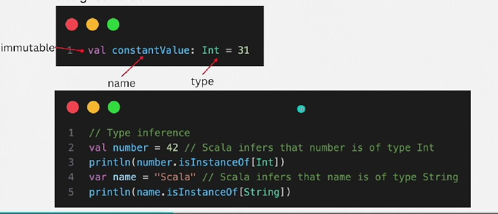
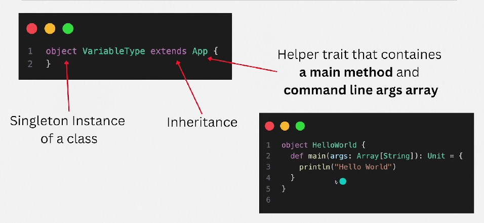

## 1. Mutable vs Immutable

- The term mutable and immutable refer to the ability of an object to be changed after it has been created.

- Mutable: A mutable object can be modified after it is created. This means you can change its state, properties, or content without creating a new object.

    - var - can be reassigned, meaning the reference they hold can be changed to point to a different value

- Immutable: An immutable object, once created, cannot be altered. Any modifications to it will result in the creation of a new object. The state of the object remains constant after its construction.

    - val - constant reference to a value

## 2. Type Inference

- Scala has a powerful type inference system. While you can explicitly specify the type of a variable, it's often not necessary as Scala can infer the type based on the assigned value.

## 3. Built-in Data Types

- Numeric Types
    - Byte: An 8-bit signed value. Range: -128 to 127
    - Short: A 16-bit signed value. Range: -32,768 to 32,767
    - Int: A 32-bit signed value, Range: -2,147,483,2,147,483,647. This is the most commonly used integer type.
    - Long: A 64-bit signed value. Range: -9,223,372,036,854,775,808 to 9,223,372,036,854,775,807. Use when Int is not large enough.
    - Float: A 32-bit IEEE 754 single-precision float. Less precision and range than Double.
    - Double: A 64-bit IEEE 754 double-precision float. It's the standard choice for floating-point calculations.

- Character and Boolean Types
    - Char: A 16-bit unsigned Unicode character. Range: U+0000 to U+FFFF.
    - Boolean: Represents true or false. Used for logical operations.
- Reference Types
    - String: Represents a sequence of characters. Strings in Scala are the same as Java strings (i.e., java.lang.String)

- Specialized Types
    - Unit: Corresponds to void in Java. It's used as the result type of a method that doesn't return any meaningful value.
    - Null: It's type of the null literal. It's a subtype of all reference types, but not of value types.
    - Nothing: It's a subtype of every other type; includes no values. It's used to signal abnormal termination, such as an exception.
    - Any: The supertype of all types, which includes both value types and reference types
    - AnyVal: The parent class of all value types.
    - AnyRef: The base type of all reference types (equivalent to java.lang.Object in Java)

## 2. Extends App

