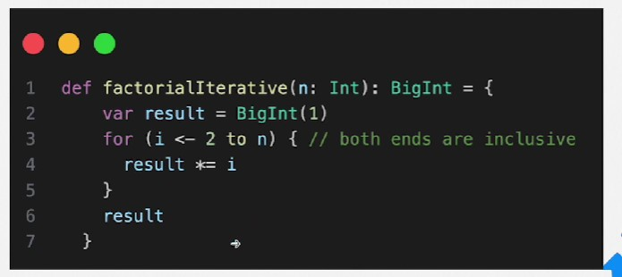
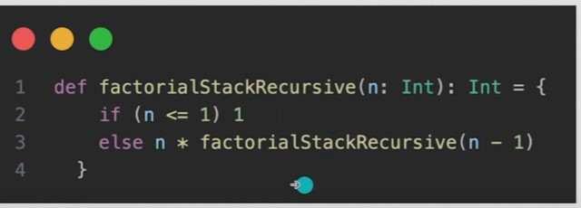
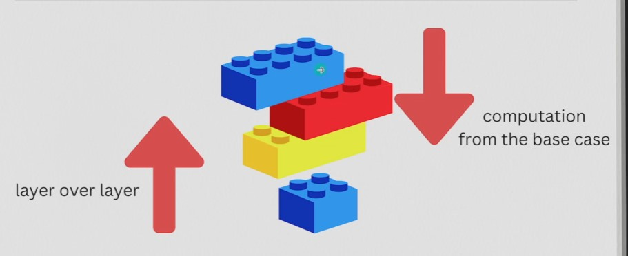
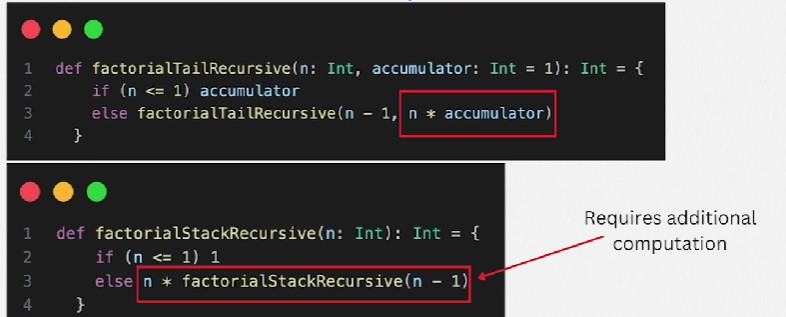

## 1. Iteration vs Recursion

- Both fundamental programming concepts used to repeat a sequence of instructions, but they differ in their approach and execution.

## 2. Iteration

- The repetition of a block of statements (a loop) until a specified condition is met.

- Mechanism
    - A loop (such as for, while, or do-while in many programming languages) is used to repeat a set of operations. The state is usually managed with loop counters or other control variables.

- Stack Usage

    - Iteration typically uses constant stack space. It's generally more memory-efficient as the same set of variables is reused for each iteration

## 3. Recursion

- A preocess in which a function calls itself as a subroutine. This allows the function to repeat its actions.

- Mechanism

    - A base case, which ends the recursion

    - A recursive case, which breaks down the problem into smaller instances and calls the same function.

- Stack Usage
    
    - Each recursive call adds a new layer to the stack, which means that each call maintains its own set of local variables and state. This can lead to high memory usage and, in some cases, a stack overflow error if the recursion is too deep.

## 4. Stack Recursion

- How to prevent Stack Overflow error?

## 5. Tail Recursion

- A recursive function is tall-recursive when the recursive call is the last operation in the function. That is, the result of the recursive call is directly returned by the function, and there's no additional computation after it.

- Optimization

    - Tail recursion can be optimized by the compiler into a loop (uses constant stack space), which prevents the accumulation of stack frames. This optimization is known as tall call optimization (TCO)

- Advantage

    - This approach avoids stack overflow errors for large numbers of recursive calls, making it suitable for iterative processes in a functional style